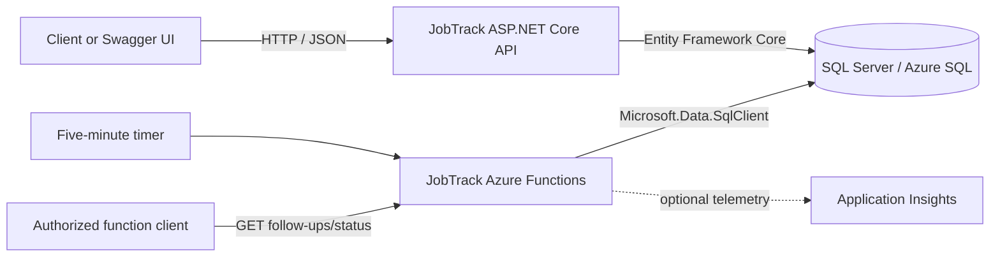

# JobTrack

JobTrack is a small job-application tracking backend built on ASP.NET Core and SQL Server. It provides a REST API for managing applications, a dashboard summary grouped by status, and an Azure Functions companion service that identifies applications that have been waiting for follow-up for at least seven days.

## Features

- Create, read, update, delete, and filter job applications
- Summarize applications by status for a dashboard
- Expose a lightweight API health endpoint
- Detect applications requiring follow-up on a five-minute schedule
- Query the current follow-up count through an Azure Functions HTTP endpoint
- Explore and test the API through Swagger UI
- Run controller tests with xUnit and an EF Core in-memory database
- Build, test, package, and deploy the API with Azure Pipelines

## Technology stack

| Area | Technology |
| --- | --- |
| REST API | ASP.NET Core 10, controllers, Swagger/OpenAPI |
| Data access | Entity Framework Core 10, SQL Server |
| Background processing | Azure Functions v4, .NET 8 isolated worker |
| Observability | .NET logging; optional Application Insights through OpenTelemetry for Functions |
| Tests | xUnit, EF Core In-Memory, Coverlet |
| Delivery | Azure Pipelines, Azure App Service |

## Architecture



The solution contains the following projects:

```text
JobTrack/
├── JobTrack.Api/                 ASP.NET Core REST API and EF Core migrations
│   ├── Controllers/              HTTP endpoints
│   ├── Data/                     EF Core DbContext
│   ├── Migrations/               SQL Server schema history
│   └── Models/                   Domain/data model
├── JobTrack.Api.Tests/           API controller tests
├── JobTrack.Functions/           Timer and HTTP-triggered Azure Functions
├── JobTrack.slnx                 API, Functions, and test solution
└── azure-pipelines.yml           Build, test, package, and API deployment pipeline
```

The API and Functions project share the same `JobApplications` SQL table, but
use different data-access approaches: the API uses EF Core while Functions uses
SQL queries through `Microsoft.Data.SqlClient`. Both projects are included in
the solution and CI build.

## Prerequisites

Install the following tools:

- [.NET 10 SDK](https://dotnet.microsoft.com/download/dotnet/10.0) for the API and tests
- [.NET 8 SDK](https://dotnet.microsoft.com/download/dotnet/8.0) for Azure Functions
- SQL Server or an accessible Azure SQL Database
- [EF Core CLI tools](https://learn.microsoft.com/ef/core/cli/dotnet), for applying or creating migrations
- [Azure Functions Core Tools v4](https://learn.microsoft.com/azure/azure-functions/functions-run-local), only if running Functions locally
- [Azurite](https://learn.microsoft.com/azure/storage/common/storage-use-azurite), only if the Functions host requires local Azure Storage emulation

Install the EF Core CLI if it is not already available:

```bash
dotnet tool install --global dotnet-ef
```

Verify the SDKs installed on your machine:

```bash
dotnet --list-sdks
```

## Installation and local setup

### Quick start with Docker

Docker is the easiest way to run the API and SQL Server together:

```bash
cp .env.example .env
docker compose up --build
```

The API is then available at `http://localhost:5208`, with Swagger UI at
`http://localhost:5208/swagger`. The database schema is created automatically.
Values in `.env` are for local development only and must not be reused in a
deployed environment.

Stop the containers without deleting the database:

```bash
docker compose down
```

To also delete the local database volume and all of its JobTrack data:

```bash
docker compose down --volumes
```

On ARM-based computers, the SQL Server container runs through `linux/amd64`
emulation and may start more slowly.

### Manual setup

### 1. Clone and restore

```bash
git clone <repository-url>
cd JobTrack
dotnet restore JobTrack.slnx
dotnet restore JobTrack.Functions/JobTrack_Functions.csproj
```

### 2. Create a SQL Server database

Create an empty database named `JobTrack`, or choose another name and update the connection strings below. A typical local SQL Server connection string is:

```text
Server=localhost;Database=JobTrack;User Id=<user>;Password=<password>;TrustServerCertificate=True;
```

For LocalDB on Windows, you can use:

```text
Server=(localdb)\MSSQLLocalDB;Database=JobTrack;Trusted_Connection=True;TrustServerCertificate=True;
```

### 3. Configure the API

The API requires `ConnectionStrings:DefaultConnection`. For local development, store it with .NET user secrets so credentials do not enter source control:

```bash
dotnet user-secrets set \
  "ConnectionStrings:DefaultConnection" \
  "Server=localhost;Database=JobTrack;User Id=<user>;Password=<password>;TrustServerCertificate=True;" \
  --project JobTrack.Api
```

You may instead provide the standard ASP.NET Core environment variable:

```bash
export ConnectionStrings__DefaultConnection="<your-connection-string>"
```

### 4. Apply the database migration

```bash
dotnet ef database update --project JobTrack.Api
```

This creates the `dbo.JobApplications` table from the checked-in initial migration.

### 5. Run the API

```bash
dotnet run --project JobTrack.Api
```

The default launch profile serves the API at:

- API: `http://localhost:5208`
- Swagger UI: `http://localhost:5208/swagger`
- Health check: `http://localhost:5208/health`

The HTTPS launch profile also uses `https://localhost:7235`. If needed, trust the local development certificate with `dotnet dev-certs https --trust`.

### 6. Configure and run Azure Functions (optional)

Add `SqlConnectionString` to `JobTrack.Functions/local.settings.json`. Keep this file local and never commit real credentials:

```json
{
  "IsEncrypted": false,
  "Values": {
    "AzureWebJobsStorage": "UseDevelopmentStorage=true",
    "FUNCTIONS_WORKER_RUNTIME": "dotnet-isolated",
    "SqlConnectionString": "Server=localhost;Database=JobTrack;User Id=<user>;Password=<password>;TrustServerCertificate=True;"
  }
}
```

Start Azurite if you use `UseDevelopmentStorage=true`, then start the Functions host:

```bash
cd JobTrack.Functions
func start --port 7191
```

The timer-triggered `FollowUpReminder` runs every five minutes. The function logs each application whose status is exactly `Applied` and whose application date is at least seven days old; it does not currently send email or other notifications.

The HTTP-triggered status endpoint is:

```text
GET http://localhost:7191/api/follow-ups/status
```

It uses `AuthorizationLevel.Function`. The local Functions host normally permits local calls without a key; a deployed call must include a function key using the `?code=<function-key>` query parameter or the `x-functions-key` header.

To export Functions telemetry to Application Insights, set `APPLICATIONINSIGHTS_CONNECTION_STRING` in the local settings or deployed Function App configuration.

## API reference

All application routes are rooted at `/api/JobApplications`.

| Method | Route | Description | Success response |
| --- | --- | --- | --- |
| `GET` | `/api/JobApplications` | Return a paginated application list | `200 OK` |
| `GET` | `/api/JobApplications?status=Interview&search=engineer&page=1&pageSize=20` | Filter and search applications | `200 OK` |
| `GET` | `/api/JobApplications/{id}` | Get one application | `200 OK` |
| `POST` | `/api/JobApplications` | Create an application | `201 Created` |
| `PUT` | `/api/JobApplications/{id}` | Replace the editable fields of an application | `200 OK` |
| `DELETE` | `/api/JobApplications/{id}` | Delete an application | `204 No Content` |
| `GET` | `/api/JobApplications/dashboard` | Return counts grouped by status | `200 OK` |
| `GET` | `/health` | Return API health and a UTC timestamp | `200 OK` |

Example request:

```bash
curl -X POST http://localhost:5208/api/JobApplications \
  -H 'Content-Type: application/json' \
  -d '{
    "company": "Example Corp",
    "position": "Software Engineer",
    "status": "Applied",
    "appliedDate": "2026-08-17T15:00:00Z",
    "salary": 120000,
    "notes": "Applied through the company website"
  }'
```

The list endpoint accepts `page` (default `1`), `pageSize` (default `20`, maximum
`100`), `search`, `status`, `sortBy`, and `sortDirection`. Supported sort fields
are `appliedDate`, `company`, `position`, `salary`, and `status`; direction is
`asc` or `desc`. Its response contains `items`, `page`, `pageSize`, `totalItems`,
and `totalPages`.

Application fields:

| Field | Type | Rules/default |
| --- | --- | --- |
| `id` | integer | Database-generated; response-only |
| `company` | string | Required, maximum 150 characters |
| `position` | string | Required, maximum 150 characters |
| `status` | string | Validated; defaults to `Applied` when creating |
| `appliedDate` | ISO 8601 date/time | Defaults to the current UTC time; converted to UTC on create |
| `salary` | decimal or null | Optional; stored as `decimal(18,2)` |
| `notes` | string or null | Optional, maximum 1,000 characters |

Supported statuses are `Saved`, `Applied`, `Interview`, `Offer`, `Rejected`, and
`Withdrawn`. Inputs and filters are case-insensitive and responses use canonical
casing. Validation failures and missing resources use standard Problem Details
responses.

## Testing

Run all tests in the solution:

```bash
dotnet test JobTrack.slnx
```

Collect code coverage in the same format used by CI:

```bash
dotnet test JobTrack.Api.Tests/JobTrack.Api.Tests.csproj \
  --collect "XPlat Code Coverage"
```

The existing tests exercise DTO mapping, status validation, search, sorting,
pagination, safe updates, and missing-record behavior with an isolated in-memory
database.

## Database migrations

After changing the data model, create and apply a migration:

```bash
dotnet ef migrations add <MigrationName> --project JobTrack.Api
dotnet ef database update --project JobTrack.Api
```

Review generated migrations before committing them, especially when a change may alter or remove existing data.

## Configuration reference

| Setting | Component | Required | Purpose |
| --- | --- | --- | --- |
| `ConnectionStrings:DefaultConnection` | API | Yes | EF Core SQL Server connection |
| `SqlConnectionString` | Functions | Yes | Direct SQL connection used by both functions |
| `AzureWebJobsStorage` | Functions host | Yes | Functions host storage; local configuration uses Azurite |
| `FUNCTIONS_WORKER_RUNTIME` | Functions host | Yes | Must be `dotnet-isolated` |
| `APPLICATIONINSIGHTS_CONNECTION_STRING` | Functions | No | Enables Azure Monitor OpenTelemetry export |

In Azure App Service, configure the API connection string through App Service Configuration or a Key Vault reference. In Azure Functions, add the Functions settings as application settings. Do not store production secrets in `appsettings*.json`, `local.settings.json`, pipeline YAML, or source control.

## CORS and security notes

- The API currently permits browser requests only from origins beginning with `http://localhost:`. Update the `AngularApp` CORS policy before deploying a browser frontend on another origin.
- The API currently has no authentication or authorization. Place it behind an appropriate identity/access layer before storing sensitive or personal data in production.
- Swagger is currently enabled in every environment. Consider limiting it to development or protecting it in production.
- The Functions status endpoint requires a function key after deployment; the timer trigger is not publicly callable.

## CI/CD

`azure-pipelines.yml` runs for pushes to `main` and:

1. Installs the .NET 10 SDK.
2. Restores and builds the API, tests, and Azure Functions in `Release` mode.
3. Runs the xUnit tests and collects coverage.
4. Publishes separate zipped API and Azure Functions artifacts.
5. Deploys it to a Linux Azure App Service.

Before using the pipeline in another Azure DevOps project, update these variables:

- `azureSubscription`: the Azure Resource Manager service connection name
- `appServiceName`: the target Azure App Service name
- `artifactName`: optional artifact naming override

The target App Service must have `ConnectionStrings__DefaultConnection` (or
the equivalent App Service connection-string entry) configured. Database
migrations are not applied by the current pipeline. The Functions artifact is
built and retained by CI, but deployment requires a separately configured
Function App and deployment stage.

## Troubleshooting

**The API says `Connection string 'DefaultConnection' was not found`.**  
Set the user secret or the `ConnectionStrings__DefaultConnection` environment variable before starting the API.

**The API cannot connect to SQL Server.**  
Confirm the server is reachable, the database exists, credentials are valid, and encryption/certificate options match the server. For local development with an untrusted certificate, `TrustServerCertificate=True` is commonly needed.

**`dotnet ef` is not recognized.**  
Install or update the CLI with `dotnet tool install --global dotnet-ef` or `dotnet tool update --global dotnet-ef`.

**Functions reports that SQL configuration is missing.**  
Add `SqlConnectionString` under `Values` in `JobTrack.Functions/local.settings.json`, or set it in the Function App configuration.

**Functions cannot connect to local storage.**  
Start Azurite, or replace `UseDevelopmentStorage=true` with a valid Azure Storage connection string.

**Browser requests are blocked by CORS.**  
The current policy accepts only `http://localhost:<port>` origins. Add the deployed frontend origin to the policy in `JobTrack.Api/Program.cs`.

## Contributing

Contributions are welcome. Read [CONTRIBUTING.md](CONTRIBUTING.md) before
opening an issue or pull request, and report suspected vulnerabilities through
the process in [SECURITY.md](SECURITY.md).

## License

JobTrack is available under the [MIT License](LICENSE).
